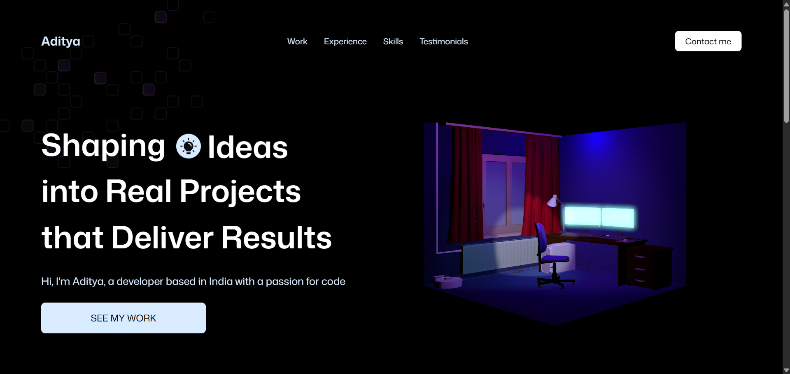

# 3D Portfolio Tutorial Project

This project is a learning exercise based on a tutorial for building a 3D portfolio website using React, Vite, Three.js, GSAP, and TailwindCSS. It is not a real portfolio, but rather a sandbox to explore modern web animation and 3D rendering techniques.



## Overview

This app demonstrates:

- Integrating 3D models and scenes with Three.js via React Three Fiber
- Smooth animations and scroll effects using GSAP (GreenSock Animation Platform)
- Responsive layouts and modern styling with TailwindCSS
- Modular React component architecture

## Features

- Animated hero section with 3D model
- Scroll-triggered and staggered animations
- Responsive navigation bar
- Animated counters and showcase cards
- Organized constants for easy content management

## Technologies Used

- **React** (with Vite for fast development)
- **Three.js** (via @react-three/fiber and @react-three/drei)
- **GSAP** and **@gsap/react** for animations
- **TailwindCSS** for styling
- **React Responsive** for device-based rendering

## Project Structure

```
├── public/                # Static assets (images, etc.)
├── src/
│   ├── App.jsx            # Main app component
│   ├── main.jsx           # Entry point
│   ├── index.css          # Tailwind and custom styles
│   ├── Constants/         # Static data (navigation, words, etc.)
│   ├── Components/        # UI components (Navbar, LogoSection, Button, AnimatedCounter, HeroModels/)
│   └── Sections/          # Page sections (Hero, ShowcaseSection, FeatureCards)
├── package.json           # Project metadata and dependencies
├── vite.config.js         # Vite configuration
```

## Getting Started

1. **Install dependencies:**
   ```bash
   npm install
   ```
2. **Run the development server:**
   ```bash
   npm run dev
   ```
3. **Open your browser:**
   Visit [http://localhost:5173](http://localhost:5173) to see the app.

## Acknowledgements

- This project follows a tutorial for educational purposes.
- Credit to the authors of the tutorial and the creators of the libraries used.

---

**Note:** This is not a real portfolio. It is a sandbox for learning GSAP and Three.js with React.
